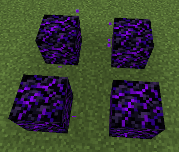
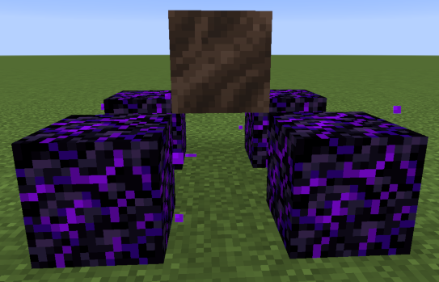
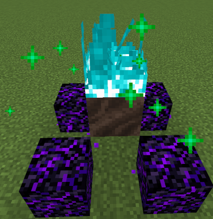
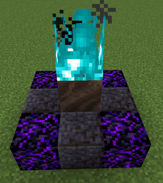
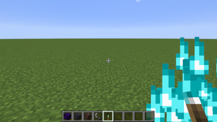

# Introduction

Soul Pyre is a survival-friendly datapack that adds a new buildable structure, the soul pyre.
Active soul pyres prevent natural hostile mob spawns in a 64 block radius around them, letting you build without having to worry about lighting!

# Compatibility

This datapack doesn't require any resource pack, and is available for Minecraft versions 1.16.5 and greater.
Since this datapack is compatible with Minecraft 1.16.5, if you are using a newer version of Minecraft you may see a warning that the pack is for an old version. However, this pack has been tested on versions up to 1.20.1 without issues, so it should work despite the warning.

# Building

To build a soul pyre, start by placing down 4 crying obsidian in a square, 1 block apart each.

Then, place either soul sand or soul soil 1 block above in the center.

To activate the pyre, light the soul sand on fire. If it worked, you'll see green particles and hear a blaze sound effect.

The empty spaces are free to fill with whichever blocks you want!

# More Information

Once built, a pyre will stay active until any of the blocks it's made of get removed. This includes the fire on top, which is considered part of the structure.

An active pyre will despawn mobs that spawn within 64 blocks of itself.
However, mobs that have already been spawned, either during worldgen, or because they were outside the radius, are immune to this.
This means you should still build walls around any areas you don't want hostiles walking into.

If you want to see whether or not an area is within range of a pyre, you can hold a soul torch in your hand. The torch will react to the pyre and give off flame particles so long as you are within range.

Mobs that spawn as part of a raid are unaffected by pyres.

The list of mobs the pyre protects against can be configured using the tag `sigmastar:pyre/pyre_despawn`. By default this tag includes the following mobs:

- Creeper
- Drowned
- Enderman
- Ghast
- Hoglin
- Husk
- Magma Cube
- Phantom
- Piglin
- Pillager
- Skeleton
- Slime
- Spider
- Stray
- Witch
- Zoglin
- Zombie
- Zombie Villager
- Zombified Piglin

This default list is meant to protect against hostiles that can spawn naturally without needing a spawner, a structure, or player action.
